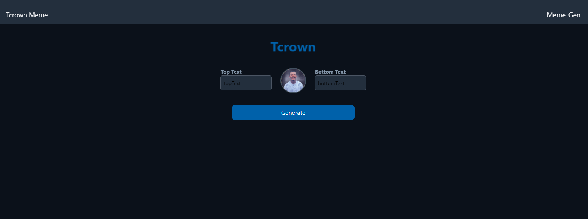
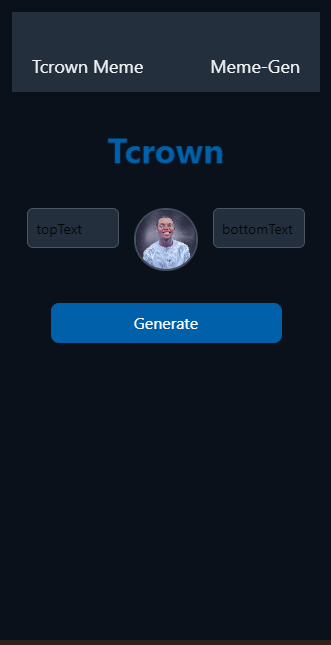

# MEME GENERATOR  (REACT PROJECT)

## Table of contents

  -[Overview](#overview)
  -[Screenshot](#screenshot)
  -[Links](#links)
  -[Built with](#built-with)
  -[Author](#author)
  

## Overview

 Few features in my Meme Generator app

- Random Image Selection: Choose from preloaded memes, upload custom images, or generate random memes.
- Text Customization: Add top/bottom text, adjust font style, size, color, and position.
- Image Editing: Resize, crop, and apply filters to the meme image.
- Responsive Layout: Works on mobile and desktop devices.
- Dynamic Text Styling: Automatically adjust text color based on the image background for readability.
- Save & Share: Download memes or share directly to social media.
- Interactive Preview: Live preview of meme creation.
- API Integration: Option to fetch meme templates from meme APIs.
- Text & Image Effects: Add text shadows and customize background colors.
- Reset/Undo: Allows undoing changes or resetting to the original state.

### Screenshot (desktop and mobile view)

### Links

- Live Site URL: [live site URL]( https://meme-crown.vercel.app/ )

### Built with

- Reactjs
- javascript
- Tailwind
- Vite

## Author

-BOLAJI OLUWATOBI.

THANKS.